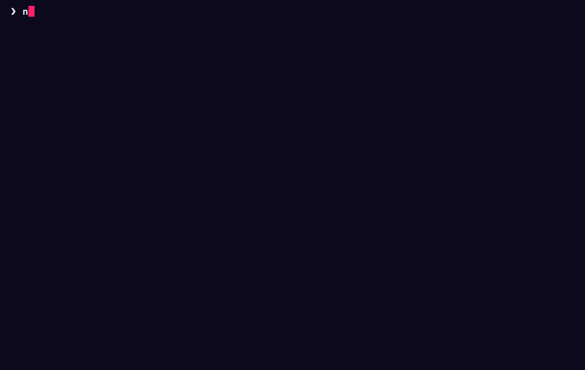
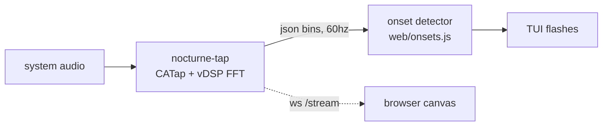

```
 ███╗   ██╗ ██████╗  ██████╗████████╗██╗   ██╗██████╗ ███╗   ██╗███████╗
 ████╗  ██║██╔═══██╗██╔════╝╚══██╔══╝██║   ██║██╔══██╗████╗  ██║██╔════╝
 ██╔██╗ ██║██║   ██║██║        ██║   ██║   ██║██████╔╝██╔██╗ ██║█████╗
 ██║╚██╗██║██║   ██║██║        ██║   ██║   ██║██╔══██╗██║╚██╗██║██╔══╝
 ██║ ╚████║╚██████╔╝╚██████╗   ██║   ╚██████╔╝██║  ██║██║ ╚████║███████╗
 ╚═╝  ╚═══╝ ╚═════╝  ╚═════╝   ╚═╝    ╚═════╝ ╚═╝  ╚═╝╚═╝  ╚═══╝╚══════╝
```

<div align="center">

### `AN APARTMENT BUILDING THAT HEARS YOUR MUSIC // IN YOUR TERMINAL`

*windows flash on every hit of whatever your mac is playing, no blackhole, no loopback devices*

    -d97706?style=flat-square&labelColor=111111)



</div>

---

## 🌃 What is this

A music visualizer shaped like an apartment building at night. Kick drums light up bursts of windows, snares light a few, hi-hats flick single rooms on and off. Between hits the building goes dark, because that is what buildings do at 3am.

It taps macOS system audio directly through Core Audio process taps (macOS 14.4+), so it hears Music.app, Cider, a browser tab, anything. No BlackHole driver, no multi-output device, no routing your audio through a virtual cable like it's 2019. A ~230-line Swift helper does the tap and the FFT; the CLI draws the building with truecolor half-blocks and a fake moon.

There is also a browser version with the same building in canvas, and `--web` serves it on localhost fed by the same tap, so the terminal and the browser flash in sync. Two buildings, one song.

```console
nick@nocturne:~$ nocturne --app Music
[✓] tapping Music.app. the bottom floors just took a kick drum.
[i] status line says ♪ Loser — Tame Impala. the tenants disagree.
```

## 🪟 The windows

| | feature | what it actually does |
|---|---|---|
| 01 | **twinkle engine** | flashes windows for ~300ms on musical onsets: bass fires big scattered bursts, mids medium ones, hats single sparkles |
| 02 | **system audio tap** | core audio process taps via the bundled swift helper, streams web-audio-style fft bins at 60hz over stdout |
| 03 | **half-block renderer** | truecolor ▀ cells give square-ish pixels: tall windows, ledges, a round moon, a water tank, a blinking antenna |
| 04 | **`--web` live mirror** | serves the canvas web app on localhost and streams the same bins over a websocket, both surfaces flash together |
| 05 | **now-playing label** | asks Music.app (without launching it), then cider's local api, and puts the track in the status line |
| 06 | **`--app` / `--file`** | narrow the tap to one app, or play a file through afplay and visualize that |
| 07 | **`--sim`** | fake 120bpm groove when nothing is playing (demos, offices, monasteries) |
| 08 | **reseed** | `r` draws a new building, `--seed` pins one (the same seed is always the same building) |

## 🚀 Run it

Needs macOS 14.4+, [bun](https://bun.sh), and the Xcode command line tools (for `swiftc`). First run pops the System Audio Recording permission prompt, attributed to your terminal app.

```bash
git clone https://github.com/nitrimandylis/nocturne.git
cd nocturne
bun run compile   # → ~/.bun/bin/nocturne + nocturne-tap, man page, agent skill
nocturne
man nocturne      # full reference, offline
```

Play something. If every window stays dark, check System Settings > Privacy & Security for the audio recording permission.

The repo ships an agent skill at `nocturne-cli/SKILL.md` (installed by `compile`): it tells whatever agent is driving your terminal that nocturne is a fullscreen TUI that never exits on its own, that only `--help` is safe to run unattended, and which traps to avoid. Point any agent at it, it is not claude-specific.

## 🔩 Under the hood



| file | job |
|---|---|
| `nocturne.ts` | cli, tap subprocess, half-block renderer, `--web` server |
| `scene.ts` | pure layout in pixel space, tested |
| `helper/nocturne-tap.swift` | core audio process tap, FFT, json lines on stdout |
| `web/` | the standalone browser version (file drop, mic, and the system-audio mirror) |
| `web/onsets.js` | the one copy of the onset logic, run by both the browser and the cli |
| `nocturne-cli/SKILL.md` | operating instructions for coding agents |

**Stack:** bun · typescript · swift (core audio, accelerate) · canvas · zero runtime dependencies

---

<div align="center">

**[Nick Trimandylis](https://github.com/nitrimandylis)**

`THE LIGHTS ARE ON BUT NOBODY IS HOME`

MIT licensed.

</div>
